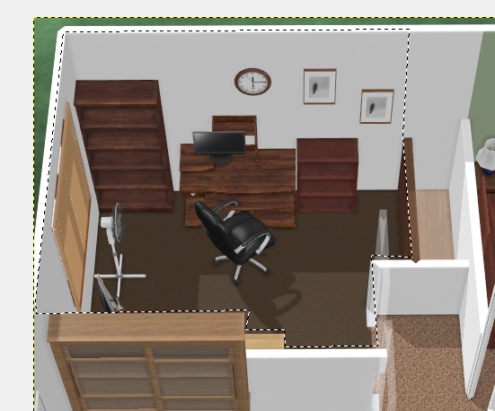
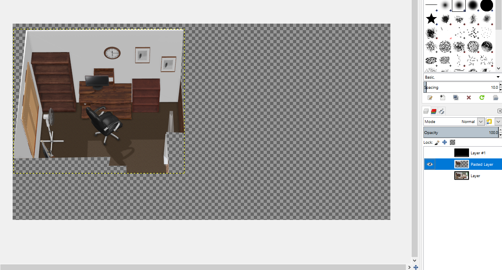
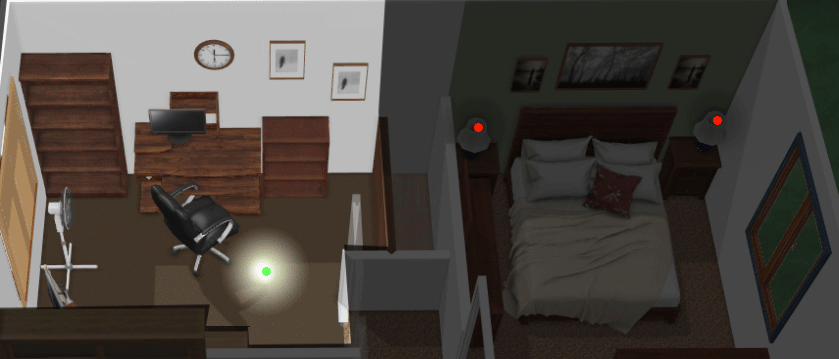

# Lesson 2 - Room Lights

OK, now that we have basic switches working on an image element card, we're going to go to the next step.   **Room Lighting.**
 
 
To do this, we need a room.
 

1. Download GIMP image editing software from [Gimp.org](http://gimp.org/)

2. Open the [lesson2.psd](https://github.com/bradcrc/color-lite-card/blob/master/tutorial/Lesson-2-Room/Lesson-Files/lesson2.psd) file in Gimp

3. Use the lasso tool

4. Click on each point forming lines to select the outline of the office room.  You don't need to draw the lines manually, just click the corners.

5. Copy the room.

6. Paste into floating layer, then hit the button to make it into a new layer

 
7. Click the eye in front of the base layer to hide it so you only see the room shown.

8. **File > Export As  > office.png**  

     Note: Save the full image including all blank space if you don't want to mess with aligning it later.  Empty space is fine, just make sure your full screen images are below any clickable images by putting them first in your yaml file.
 

9. Copy your office.png file to your /www/tutorial folder with your other images.

10. Download [color-lite.card.js](https://github.com/bradcrc/color-lite-card) from https://github.com/bradcrc/color-lite-card

11. Copy the js file to your config/www/js folder 

12. Add the following line to the resources area near the top of your ui-lovelace.yaml

		resources:
		  - url: /local/js/color-lite-card.js
			type: js

		
13. Add the following to your tutorial section near the bottom of your ui-lovelace.yaml
	replace office_light with the name of the light you hooked to that switch. (use the same light or this won't work)

          - type: custom:color-lite-card
            entity: light.office_light
            tap_action:
              action: none    
            image:
              /local/tutorial/office.png   
            style:
              top: 50%
              left: 50%
              width: 100%  		
	
	
	
That's it!
 
Save your changes and reload your tutorial tab.   Click the dot to turn the light on or off,  click and hold to get the properties screen and dim the bulb.  

[On to Lesson 3](https://github.com/bradcrc/color-lite-card/tree/master/tutorial/Lesson-3-Lamp)
