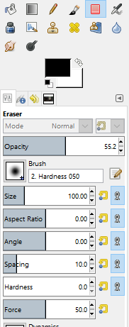
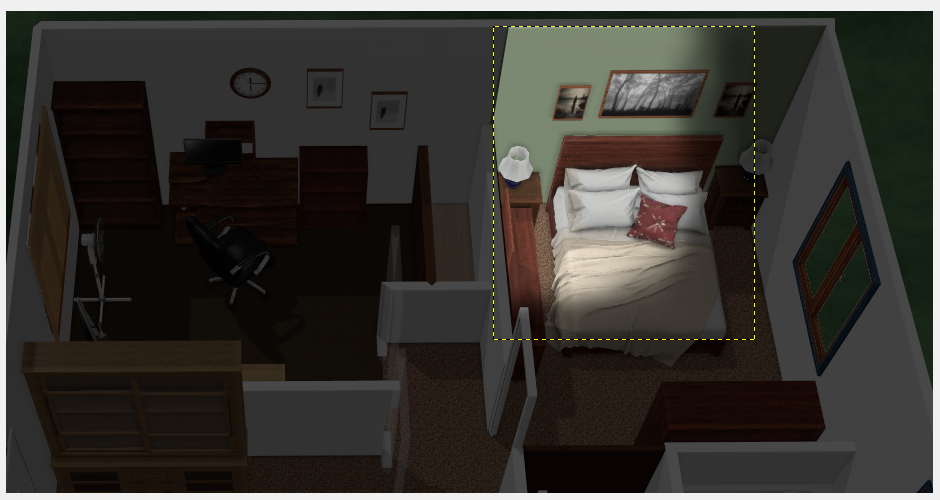
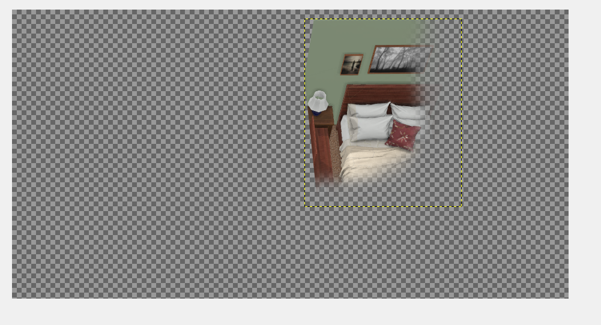

# Lamp Tutorial

Lets do a lamp.

1. Back in GIMP, let's select the base layer of our image

2. Use the lasso tool to copy the area around our middle lamp

3. Paste and hit the new layer button to create a new layer of just the lamp area.

4. That's nice, but lets clean it up a bit.   

5. Drag the pasted layer to the top.

6. Click the eye to show the base layer and the dimmer layer.

7. Find the eraser tool,  set the brush to 55% opacity, 100px size, 0.0 hardness.

8. Use the eraser to soften the edge of your pasted image away from the walls so it's very softly blended.

9. De-select the other layers so you only see your selection.

10. **file > export as > lamp.png**

11. Copy your new lamp.png file to the tutorial folder.
 
 
12. Paste another copy of the same yaml as in lesson 2, but with the new entity name and image.

        - type: custom:color-lite-card
          entity: light.right_lamp
          tap_action:
            action: none    
          image:
            /local/tutorial/lamp.png   
          style:
            top: 50%
            left: 50%
            width: 100%    
			
			
Like the previous lesson,  click on the lamp to turn it on and off, and play with the dimming settings.

			