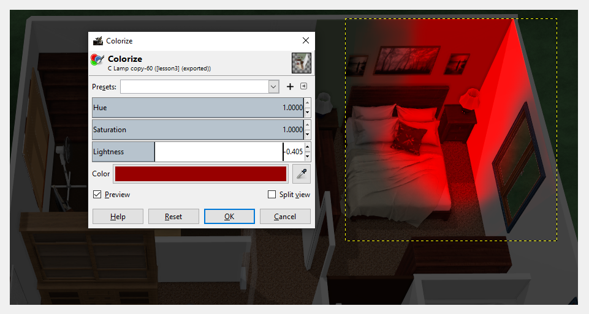

# Lesson 4 - Color Dimmable Lamp

For lesson 4, We'll just be adding a couple additional steps to the previous lesson. 

A color bulb is set up the same as a regular dimmable bulb, except an additional image is needed for color.  Hue rotation is based on a fully saturated red image so in addition to our normal image we'll need to make a copy that's pure red.

1. Repeat everything you did in lesson 3 for the remaining lamp. We'll pick up in GIMP after you've got a new layer already copied and smoothed out.
 
&nbsp; &nbsp; &nbsp;  [back to lesson 3](https://github.com/bradcrc/color-lite-card/tree/master/tutorial/Lesson-3-Lamp)
 
2. Duplicate the new lamp layer you've just created by right-clicking the layer and picking "duplicate layer" from the popup menu

3. From the color menu, pick "colorize" and set hue to 1,  saturation to 1, and lightness to -0.4

4. Set layer opacity to 60%

5. Hide all other layers and export the image as **clampcolor.png**  
 
6. Export the original non-red layer as **clamp.png**

7. We're going to put the same reference in the yaml file as the previous 2 lessons, but this time, we're adding the following:

          color_image:            
            /local/tutorial/clampcolor.png   
			
			
The whole entry will look something like this:
 
        - type: custom:color-lite-card
          entity: light.left_lamp
          tap_action:
            action: none    
          image:
            /local/tutorial/clamp.png  
          color_image:            
            /local/tutorial/clampcolor.png            
          style:
            top: 50%
            left: 50%
            width: 100% 
	    
	    
	    

[On to Lesson 5](https://github.com/bradcrc/color-lite-card/tree/master/tutorial/Lesson-5-Nite)
