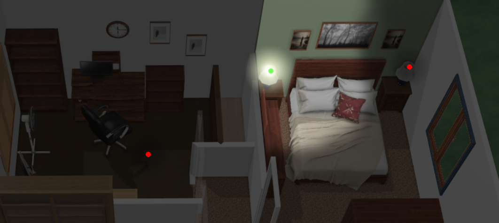

# Lesson 5 - Night Time

Ok, we've got our lights working now.  Our floorplan is dark to show off the lights nicely.

But we aren't just going to use our floorplan at night, and a dark floorplan looks silly and feels wrong if you're viewing it at noon, just as a bright one would seem wrong at night. 

Let's fix that by dynamically adjusting the darkness of our floorplan to match the darkness of the real world.

We could just use the sun -- up or down, make things dark at night, and light during the day.
 
 
But the sun isn't an on or off switch, it's more gradual.  So let's do things a bit better,  we'll make a sensor to give us varying degrees of lightness according to the sun's height.  We can get this value from sun.sun which is part of home assistant by default.
 
first we'll build a sensor and put that in the sensor area of our config.yaml.
 
       sun_brightness:
        friendly_name: "Sun Brightness"
        value_template: >-
          
            bright
          
            mid    
          
            dark                
          
            black
           
		  

Copy the text from [sensor.yaml](https://github.com/bradcrc/color-lite-card/blob/master/tutorial/Lesson-5-Nite/Lesson-Files/sensor.yaml).
 
 
Then we'll replace our dimmer with conditional code that changes the darkness based on the sensor.
 
           - type: image
            entity: sensor.sun_brightness        
            image: 
              /local/floorplan/shade.png 
            style:
              top: 50%
              left: 50%
              width: 100%        
            state_filter:
              "bright": opacity(.0)                    
              "mid": opacity(.3)                    
              "dark": opacity(.66)                    
              "black": opacity(.77)       
			  
			  

Bing.   We now have a smarter floorplan that's light during the day and dark at night, with a couple stops in-between.

			  
